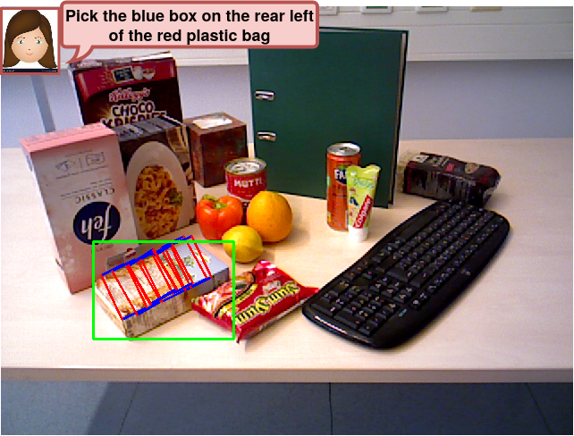

# OCID-VLG: A Vision-Language-Grasping dataset for Cluttered Indoor Scenes
OCID-VLG dataset and baselines

##
<p align="center">
  
</p>

This dataset studies the task of language-guided grasping in an end-to-end fashion. Previous works usually study such tasks in synthetic lab environments, which have a big distribution gap to natural household scenes, that usually include clutter. To that end, we provide a dataset based on OCID-Grasp, where in each scene we provide a referring expression in natural language to uniquely describe a target object, along with ground truth grasp rectangles. We benchmark our dataset for both *Referring Image Segmentation*, where the purpose is to segment a pixel-level mask of the referred object, as well as *Referring Object Grasping*, where the purpose is to also predict grasp rectangles for the referred object. It consists of 305,694 image-text-grasp triplets from 2299 unique scenes from the OCID dataset.

## Contents

- [Requirements](#requirements)
- [Dataset](#dataset)
- [Benchmarking](#benchmarking)


## Requirements
Create a python3 venv and use ``pip install -r requirements.txt``.

## Dataset

### Download
Download our OCID-VLG dataset from [this HTTP URL](https://github.com/gtziafas/OCID-VLG/edit/main/README.md) and export it in your desired ``$ROOT`` path.

### Load API
You can load the dataset using the ``OCIDVLGDataset`` class provided in this repo, which inherits from ``torch.utils.data.Dataset``. The usage is as following:
```
from dataset import OCIDVLGDataset

root_dir = 'your root path here'
dataset_train = OCIDVLGDataset(root_dir, split="train") 
sample = dataset_train[0]
```

The sample structure is:
```
#     'img'            :   (480, 640, 3), np.uint8 (RGB scene image)
#     'depth'          :   (480, 640), np.float32 (Depth scene image in meters)
#     'sentence'       :   str (Referring expression for target object)
#     'target'         :   str (Label of target object in OCID notation)
#     'target_idx'     :   int (Unique index of target object's label)
#     'bbox'           :   (4,), np.int16 (Bounding box coordinates for target object in x1y1x2y2 format)
#     'mask'           :   (480, 640), np.float 32 (Pixel-level segmentation mask for target object)
#     'grasps'         :   (N, 6), np.float32  (N Grasp rectangles for target object in [center_x,center_y,width,height,angle, target_idx] format)
#     'grasp_masks'    :  {
#                         'pos': (480, 640), np.float32 (Position grasp mask for target object)
#                         'qua': (480, 640), np.float32 (Quality grasp mask for target object)
#                         'ang': (480, 640), np.float32 (Angle grasp mask for target object)
#                         'wid': (480, 640), np.float32 (Width grasp mask for target object)
#                         }
```

you can further pass a transform for your images (e.g. standard ``torchvision.transforms``) when defining the dataset, using the key ``transform_img``, to introduce your desired pre-processing. This will affect the `img` component, `depth` and `mask` will be simply tensorized.

## Benchmarking
Placeholder

### Referring Image Segmentation
placeholder

### Referring Object Grasping
placeholder

## Acknowledgments
This dataset builds upon previous works on OCID dataset, namely:
1. [OCID](https://www.acin.tuwien.ac.at/en/vision-for-robotics/software-tools/object-clutter-indoor-dataset) ({A} Semi-Automatic Pixel-wise Object Annotation Tool for Creating Robotic {RGB-D} Datasets.)
2. [OCID-Grasp](https://github.com/stefan-ainetter/grasp_det_seg_cnn) (Ainetter, Stefan and Friedrich Fraundorfer. “End-to-end Trainable Deep Neural Network for Robotic Grasp Detection and Semantic Segmentation from RGB.” 2021 IEEE International Conference on Robotics and Automation (ICRA) (2021): 13452-13458.)
3. [OCID-Ref](https://github.com/lluma/OCID-Ref) (Wang, Ke-Jyun et al. “OCID-Ref: A 3D Robotic Dataset With Embodied Language For Clutter Scene Grounding.” North American Chapter of the Association for Computational Linguistics (2021).)
